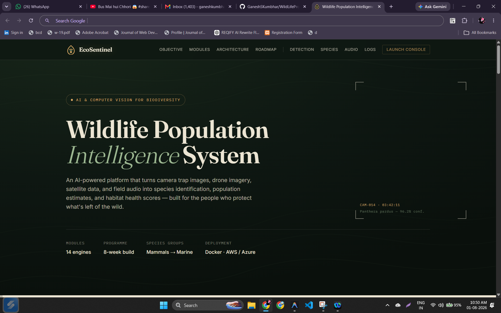
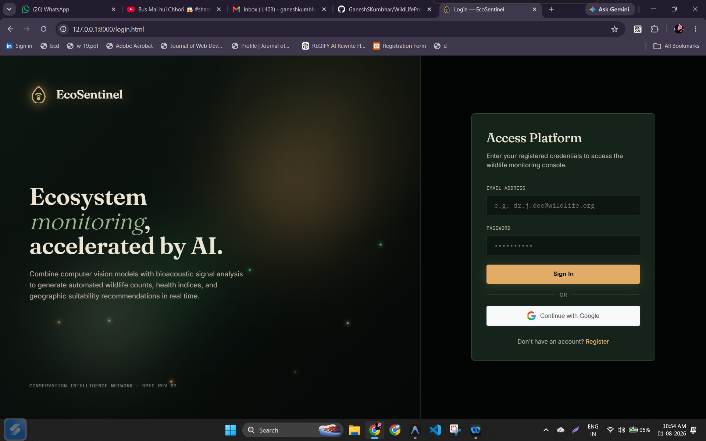
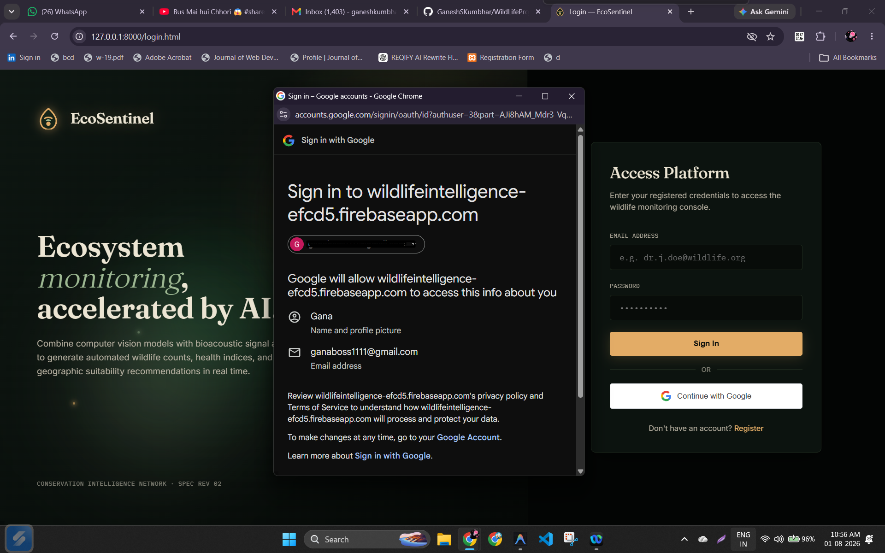
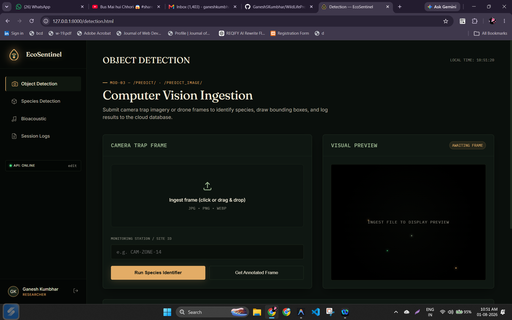
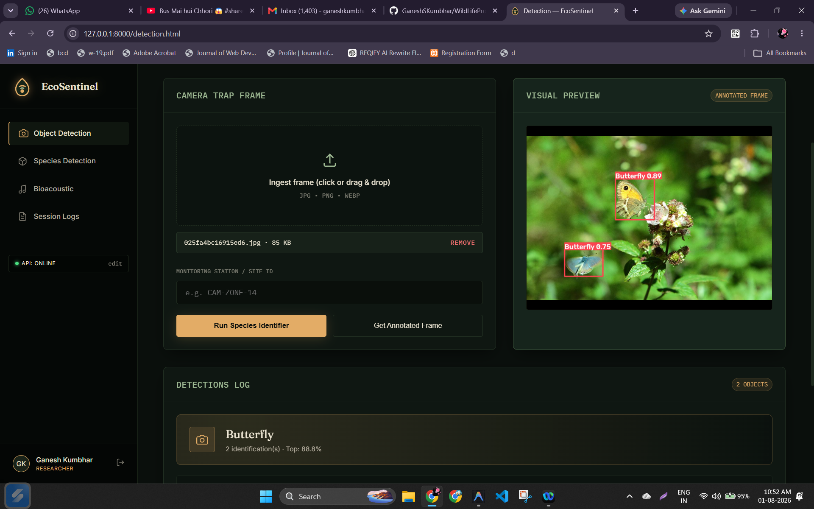
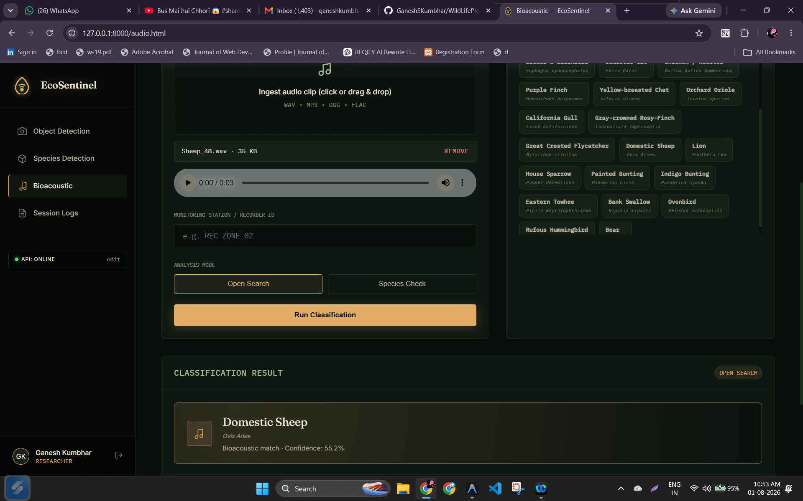
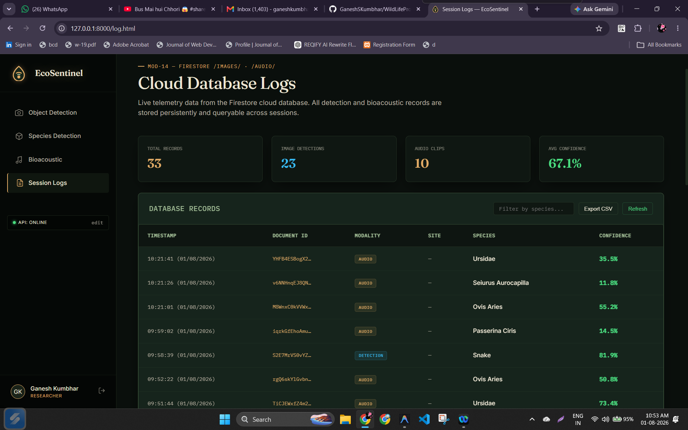
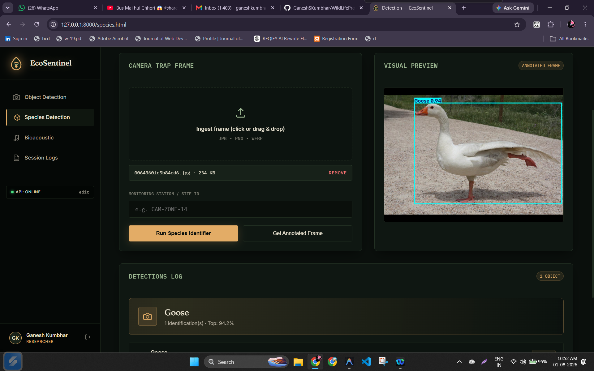

# 🐾 Wildlife Object & Audio Detection API

A full-stack wildlife monitoring system that combines **computer vision** and **audio classification** to automatically detect and identify wildlife species. The backend is built with **FastAPI**, using a custom-trained **YOLOv8** model for image-based species detection and a **TensorFlow/Keras** model for audio-based species classification. The project also includes a web frontend with authentication, detection history, and a species reference library.

---

## 📋 Table of Contents

- [Features](#-features)
- [Tech Stack](#-tech-stack)
- [Project Structure](#-project-structure)
- [Setup Instructions](#-setup-instructions)
  - [1. Prerequisites](#1-prerequisites)
  - [2. Clone the Repository](#2-clone-the-repository)
  - [3. Python Environment](#3-python-environment)
  - [4. Install Dependencies](#4-install-dependencies)
  - [5. Required Model Files](#5-required-model-files)
  - [6. Environment Variables](#6-environment-variables)
  - [7. Run the FastAPI Server](#7-run-the-fastapi-server)
- [Application Screens](#-application-screens)
- [API Endpoints](#-api-endpoints)
- [Interactive Documentation](#-interactive-documentation)
- [Troubleshooting](#-troubleshooting)
- [Contributing](#-contributing)
- [License](#-license)

---

## ✨ Features

- 🖼️ **Image Detection** — Upload wildlife photos and get bounding boxes with species names and confidence scores using a custom YOLOv8 model.
- 🎵 **Audio Classification** — Upload audio clips (roars, calls, chirps, etc.) and classify them against a trained audio model.
- 🎯 **Targeted Species Detection** — Check whether a *specific* species is present in an image or audio clip.
- 🔐 **Google Login** — Secure authentication via Google Sign-In.
- 🕒 **History Log** — Track and review past detections.
- 📚 **Species Library** — Browse reference information about detectable species.
- 📑 **Auto-generated API Docs** — Interactive Swagger UI and ReDoc out of the box.

---

## 🛠️ Tech Stack

| Layer            | Technology                                  |
|-------------------|----------------------------------------------|
| Backend Framework | FastAPI (Python)                             |
| Image Detection   | YOLOv8 (Ultralytics) — `best.pt`             |
| Audio Detection   | TensorFlow / Keras — `audio_model_v2_77.keras` |
| Label Encoding    | scikit-learn — `label_encoder_v2.pkl`        |
| Server            | Uvicorn (ASGI)                               |
| Frontend          | HTML/CSS/JS (served from FastAPI root `/`)   |
| Auth              | Google Sign-In                               |

---

## 📁 Project Structure

```
WildlifeProject/
│
├── backend/
│   ├── main.py                  # FastAPI application entry point
│   ├── routers/                 # API route definitions
│   ├── models/                  # Model-loading and inference logic
│   ├── utils/                   # Helper functions (preprocessing, drawing boxes, etc.)
│   └── requirements.txt         # Python dependencies
│
├── frontend/ (or static/)       # Web UI served at "/"
│
├── images/                      # Documentation & UI screenshots
│   ├── index.png                # Home page
│   ├── login.png                # Login page
│   ├── googleLogin.png          # Google Sign-In flow
│   ├── detection.png            # Detection in progress
│   ├── animaldetected.png       # Detection result view
│   ├── HistoryLog.png           # Detection history page
│   └── species.png              # Species reference page
│
├── best.pt                      # YOLOv8 image detection model (project root)
├── audio_model_v2_77.keras      # TensorFlow audio classification model (project root)
├── label_encoder_v2.pkl         # Label encoder for audio classes (project root)
├── .gitignore
└── README.md
```

> **Note:** Model files (`best.pt`, `audio_model_v2_77.keras`, `label_encoder_v2.pkl`) must sit **one level above** the `backend/` folder, i.e. in the project root.

---

## ⚙️ Setup Instructions

### 1. Prerequisites

- **Python 3.9 – 3.12** (recommended) — for full TensorFlow compatibility
- **pip** (comes with Python)
- **Git** (to clone the repository)
- A **CUDA-enabled GPU** is optional but recommended for faster YOLOv8 inference

### 2. Clone the Repository

```bash
git clone https://github.com/<your-username>/WildlifeProject.git
cd WildlifeProject
```

### 3. Python Environment

It's best practice to use a virtual environment:

```bash
# Create a virtual environment
python -m venv venv

# Activate it
# Windows:
venv\Scripts\activate
# macOS/Linux:
source venv/bin/activate
```

Package compatibility depends on your Python version:

- **Python 3.9 – 3.12 (Recommended):** Standard `tensorflow` is fully supported.
- **Python 3.13 / 3.14+:** Standard `tensorflow` may not yet have pre-built wheels — you'll need `tf-nightly` instead (see below).

### 4. Install Dependencies

From the `backend/` directory, install the standard requirements:

```bash
cd backend
pip install -r requirements.txt
```

**⚠️ Python 3.13/3.14+ users:** If `pip install -r requirements.txt` fails with a `tensorflow` module error, install the nightly build instead:

```bash
py -m pip install tf-nightly
```

Typical dependencies include:

```
fastapi
uvicorn[standard]
python-multipart
ultralytics
tensorflow      # or tf-nightly for Python 3.13+
scikit-learn
numpy
opencv-python
pillow
librosa         # for audio preprocessing
```

### 5. Required Model Files

Place the following files in the **project root directory** (one level above `backend/`):

| File | Description |
|------|-------------|
| `best.pt` | YOLOv8 image detection model |
| `audio_model_v2_77.keras` | TensorFlow audio classification model |
| `label_encoder_v2.pkl` | Label encoder mapping model outputs to species names |

> These files are typically large and excluded from version control via `.gitignore`. Download them separately from your model storage location (e.g., Google Drive, S3, or your training pipeline output) and place them accordingly.

### 6. Environment Variables

If your project uses Google Login or other secrets, create a `.env` file in the project root:

```env
GOOGLE_CLIENT_ID=your_google_client_id_here
GOOGLE_CLIENT_SECRET=your_google_client_secret_here
SECRET_KEY=your_app_secret_key
DATABASE_URL=your_database_connection_string   # if applicable
```

> Adjust variable names to match what your `main.py` / auth module actually expects.

### 7. Run the FastAPI Server

From inside the `backend/` directory:

```bash
python -m uvicorn main:app --reload
# Or, depending on your system alias:
py -m uvicorn main:app --reload
```

The server starts at:

```
http://127.0.0.1:8000
```

The frontend interface is automatically served at the root URL `/`.

---

## 🖥️ Application Screens

The project ships with a full web UI backed by the API. Below is a quick tour based on the app's screens:

### Home
Landing page of the application.



### Login
Standard login screen.



### Google Sign-In
OAuth login flow via Google.



### Detection in Progress
Upload and detection workflow.



### Detection Result
Annotated result showing detected species.



### Audio Detection
Interface for uploading and classifying wildlife sounds.



### History Log
Log of previous detections per user.



### Species Library
Reference page listing detectable species.



---

## 🔌 API Endpoints

### 🖼️ Image Detection

#### `POST /predict/`
Accepts an image file and returns object detection bounding boxes and confidence scores.
- **Body:** `multipart/form-data` with a `file` key containing the image.
- **Response:**
```json
{
  "detections": [
    {
      "class": "Lion",
      "confidence": 0.94,
      "bbox": [x1, y1, x2, y2]
    }
  ]
}
```

#### `POST /predict_image/`
Accepts an image file and returns the actual image with bounding boxes drawn over the detected wildlife.
- **Body:** `multipart/form-data` with a `file` key containing the image.
- **Response:** JPEG image (binary).

### 🎵 Audio Classification

#### `POST /predict_audio/`
Accepts an audio file and returns the overall wildlife audio classification result.
- **Body:** `multipart/form-data` with a `file` key containing the audio file (e.g., `.wav`, `.mp3`).
- **Response:**
```json
{
  "predicted_class": "Lion Roar",
  "confidence": 0.89
}
```

#### `POST /predict_audio/species/{species_name}`
Run a targeted prediction for a specific species.
- **Path Parameter:** `species_name` — e.g., `Lion Roar`
- **Body:** `multipart/form-data` with a `file` key containing the audio file.
- **Response:**
```json
{
  "target_species": "Lion Roar",
  "detected": true,
  "confidence": 0.89,
  "primary_prediction": "Lion Roar"
}
```

#### `GET /audio_classes/`
Returns a list of all species classes the audio model can detect.
- **Response:**
```json
{
  "classes": ["Lion Roar", "Elephant Trumpet", "Bird Chirp", "..."]
}
```

---

## 📖 Interactive Documentation

FastAPI provides automatic interactive API documentation once the server is running:

- **Swagger UI:** [http://127.0.0.1:8000/docs](http://127.0.0.1:8000/docs)
- **ReDoc:** [http://127.0.0.1:8000/redoc](http://127.0.0.1:8000/redoc)

---

## 🩺 Troubleshooting

| Issue | Possible Fix |
|-------|---------------|
| `ModuleNotFoundError: tensorflow` on Python 3.13+ | Run `py -m pip install tf-nightly` |
| `FileNotFoundError: best.pt` or `audio_model_v2_77.keras` | Ensure model files are placed in the **project root**, one level above `backend/` |
| Server starts but frontend shows 404 | Confirm static files are correctly mounted in `main.py` (e.g., `app.mount("/", StaticFiles(...))`) |
| Google Login fails | Double-check `GOOGLE_CLIENT_ID` / `GOOGLE_CLIENT_SECRET` in `.env` and authorized redirect URIs in Google Cloud Console |
| Slow inference on CPU | Install a CUDA-enabled build of PyTorch/TensorFlow and ensure a compatible GPU driver is installed |
| Audio prediction errors | Confirm `librosa` (or your audio preprocessing library) is installed and the input file format is supported |

---

## 🤝 Contributing

1. Fork the repository
2. Create a feature branch: `git checkout -b feature/your-feature`
3. Commit your changes: `git commit -m "Add your feature"`
4. Push to the branch: `git push origin feature/your-feature`
5. Open a Pull Request

---

## 📄 License

Specify your project's license here (e.g., MIT, Apache 2.0). If unsure, add a `LICENSE` file to the repository root and reference it here.

---

## 🙏 Acknowledgements

- [Ultralytics YOLOv8](https://github.com/ultralytics/ultralytics) for the image detection model architecture.
- [TensorFlow/Keras](https://www.tensorflow.org/) for audio classification.
- [FastAPI](https://fastapi.tiangolo.com/) for the backend framework.